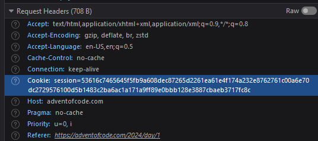

# Advent of Code 2024
Solutions by AceOfKestrels

See [adventofcode.com](https://adventofcode.com/2024/about)

The program fetches your personalized input from adventofcode.com. 
To do this it requires a session cookie for authentication.
Visit [any input page](https://adventofcode.com/2024/day/1/input) and look in your browser's dev tools for the "Cookie" header.

